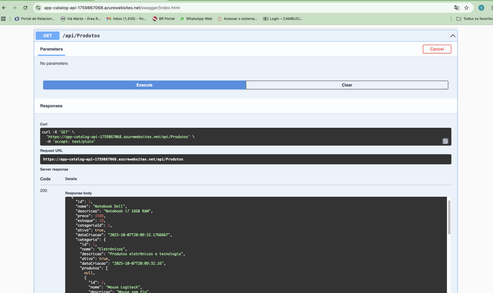
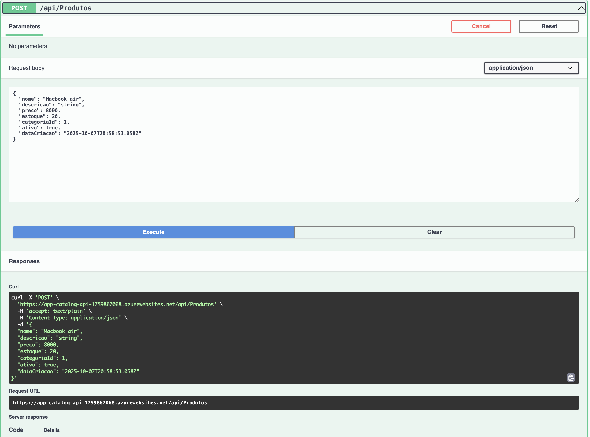
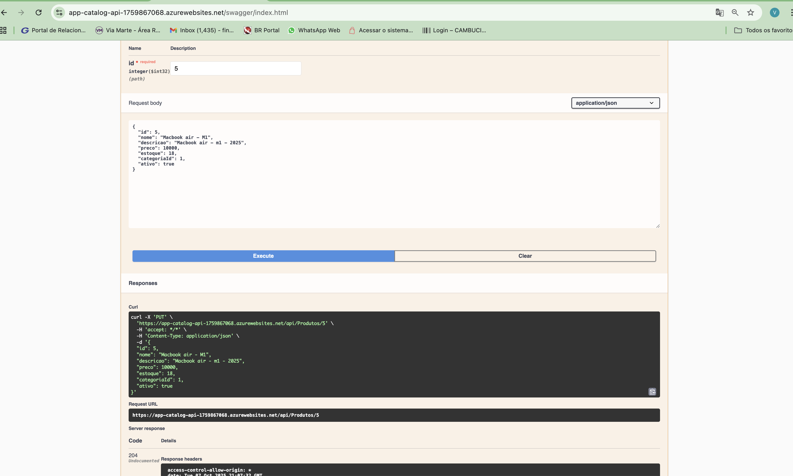
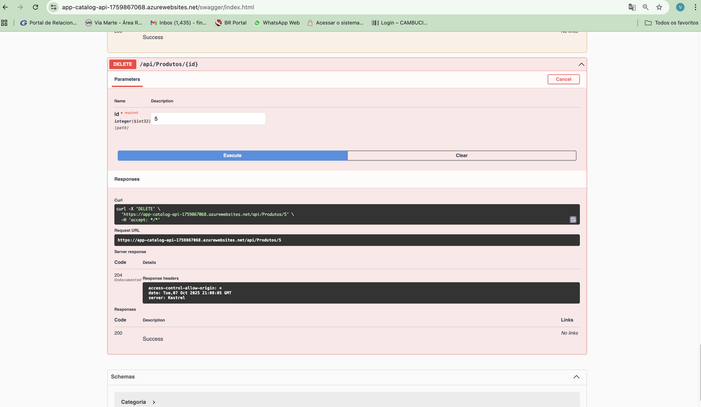

# 🚀 Azure Catalog API - Guia Completo de Deploy

## 📋 Pré-requisitos

Antes de começar, certifique-se de ter instalado:

- **Azure CLI** (versão 2.0 ou superior)
  ```bash
  # Verificar instalação
  az --version
  
  # Instalar no macOS
  brew update && brew install azure-cli
  
  # Instalar no Windows
  # Baixe o instalador em: https://aka.ms/installazurecliwindows
  
  # Instalar no Linux
  curl -sL https://aka.ms/InstallAzureCLIDeb | sudo bash
  ```

- **.NET SDK 9.0** ou superior
  ```bash
  # Verificar instalação
  dotnet --version
  
  # Baixar em: https://dotnet.microsoft.com/download
  ```

- **Conta Azure** ativa
  - Acesse: https://portal.azure.com
  - Crie uma conta gratuita se necessário

---

## 🔐 1. Login no Azure

```bash
# Fazer login na sua conta Azure
az login

# Verificar a conta ativa
az account show

# Se tiver múltiplas assinaturas, selecione a desejada
az account list --output table
az account set --subscription "NOME_OU_ID_DA_SUBSCRIPTION"
```

---

## 📁 2. Estrutura do Projeto

```
AzureCatalogAPI/
├── Controllers/
│   ├── CategoriasController.cs
│   ├── ProdutosController.cs
│   └── HealthController.cs
├── Data/
│   └── AppDbContext.cs
├── Models/
│   ├── Categoria.cs
│   └── Produto.cs
├── scripts_cli/
│   ├── 0-login-azure.sh
│   ├── 01-create-resource-group.sh
│   ├── 02-create-sql-server.sh
│   ├── 03-02-create-app-insights.sh
│   ├── 03-create-sql-database.sh
│   ├── 04-configure-firewall.sh
│   ├── 05-create-app-service-plan.sh
│   ├── 06-create-webapp.sh
│   ├── 07-configure-app-settings.sh
│   └── 08-deploy-application.sh
├── appsettings.json
├── appsettings.development.json
├── ddl.sql
├── Program.cs
├── AzureCatalogAPI.csproj
└── README.md
```

---

## 🎯 3. Deploy Passo a Passo

### 3.1. Criar Resource Group

```bash
cd scripts_cli
chmod +x *.sh  # Dar permissão de execução (macOS/Linux)

./scripts_cli/01-create-resource-group.sh
```

**O que isso faz:**
- Cria um grupo de recursos no Azure
- Região: East US 2
- Nome: `rg-catalog-api`

---

### 3.2. Criar SQL Server

```bash
./scripts_cli/02-create-sql-server.sh
```

**O que isso faz:**
- Cria um Azure SQL Server
- Usuário admin: `fiapAdmin`
- Senha: `FiapAmin2025!`
- ⚠️ **IMPORTANTE:** Anote o nome do servidor que aparece no final!

**Exemplo de output:**
```
SQL Server criado: sqlsrv-catalog-api1759850557.database.windows.net
Salve este nome para os próximos scripts!
```

---

### 3.3. Criar Database

```bash
./scripts_cli/03-create-sql-database.sh
```

**O que isso faz:**
- Cria um banco de dados SQL no servidor
- Nome: `catalogodb`
- Tier: Basic (econômico)

---

### 3.4. Configurar Firewall

```bash
./scripts_cli/04-configure-firewall.sh
```

**O que isso faz:**
- Permite acesso ao banco de dados do Azure
- Permite acesso da sua máquina local (desenvolvimento)
- ⚠️ **ATENÇÃO:** Remove a regra "AllowAllIPs" em produção!

---

### 3.5. Criar Tabelas no Banco

Agora você precisa executar o script SQL para criar as tabelas:

**Opção 1: Via Azure Portal**
1. Acesse: https://portal.azure.com
2. Vá em "SQL databases"
3. Selecione `catalogodb`
4. Clique em "Query editor"
5. Faça login com:
   - Usuário: `fiapAdmin`
   - Senha: `FiapAmin2025!`
6. Cole o conteúdo de `ddl.sql`
7. Clique em "Run"

---

### 3.6. Criar App Service Plan

```bash
./scripts_cli/05-create-app-service-plan.sh
```

**O que isso faz:**
- Cria um plano de serviço Linux
- Tier: B1 (Basic)
- Suporta aplicações .NET 9.0

---

### 3.7. Criar Web App

```bash
./scripts_cli/06-create-webapp.sh
```

**O que isso faz:**
- Cria a aplicação web
- Runtime: .NET 9.0
- Sistema Operacional: Linux
- ⚠️ **IMPORTANTE:** Anote a URL que aparece no final!

**Exemplo de output:**
```
Web App criada: https://app-catalog-api-1759851105.azurewebsites.net
```

3.8. Configurar Arquivos de Configuração
⚠️ IMPORTANTE: Antes de fazer o deploy, você precisa configurar os arquivos appsettings.json:
appsettings.Development.json (Desenvolvimento Local)

```
json{
  "Logging": {
    "LogLevel": {
      "Default": "Debug",
      "Microsoft.AspNetCore": "Information"
    }
  },
  "ConnectionStrings": {
    "DefaultConnection": "Server=localhost;Database=CatalogDB;Trusted_Connection=True;TrustServerCertificate=True;"
  }
}
appsettings.json (Produção - NÃO comitar senhas!)
json{
  "Logging": {
    "LogLevel": {
      "Default": "Information",
      "Microsoft.AspNetCore": "Warning"
    }
  },
  "AllowedHosts": "*",
  "ConnectionStrings": {
    "DefaultConnection": "Server=<SEU_SERVIDOR>;Database=<SEU_BANCO>;User Id=<USUARIO>;Password=<SENHA>;Encrypt=True;TrustServerCertificate=False;"
  },
  "ApplicationInsights": {
    "ConnectionString": "<SUA_CHAVE_APP_INSIGHTS>"
  }
}
```
📝 Valores a substituir no appsettings.json:

```
<SEU_SERVIDOR>: Ex: sqlsrv-catalog-api1759850557.database.windows.net
<SEU_BANCO>: catalogodb
<USUARIO>: fiapAdmin
<SENHA>: FiapAmin2025!
<SUA_CHAVE_APP_INSIGHTS>
```

🔒 Segurança:

NUNCA commite o appsettings.json com senhas reais no Git!
Adicione appsettings.json no .gitignore
Use placeholders (<...>) no repositório
Configure as connection strings via Azure CLI (próximo passo)

---

### 3.9. Configurar Connection String

```bash
./scripts_cli/07-configure-app-settings.sh
```

**⚠️ ANTES DE EXECUTAR:**
1. Abra o arquivo `/scripts_cli/07-configure-app-settings.sh`
2. Substitua os valores:
   - `SQL_SERVER_NAME`: Nome do seu SQL Server (passo 3.2)
   - `WEBAPP_NAME`: Nome do seu Web App (passo 3.7)

**O que isso faz:**
- Configura a connection string do banco de dados
- Configura variáveis de ambiente
- Define o ambiente como Production
---

### 3.10. Pré Deploy da Aplicação

```bash
	dotnet publish -c Release -o ./publish
cd publish && zip -r ../publish.zip .
cd ..
./scripts_cli/08-deploy-application.sh
```

---

### 3.11. Deploy da Aplicação

```bash
./scripts_cli/08-deploy-application.sh
```

**⚠️ ANTES DE EXECUTAR:**
1. Volte para a raiz do projeto: `cd ..`
2. Abra o arquivo `scripts_cli/08-deploy-application.sh`
3. Substitua `WEBAPP_NAME` pelo nome do seu Web App

```bash
./scripts_cli/08-deploy-application.sh
```


**O que isso faz:**
- Compila a aplicação .NET
- Publica os arquivos
- Cria um arquivo .zip
- Faz o upload para o Azure
- Aguarde cerca de 2-3 minutos

---

## ✅ 4. Verificar o Deploy

### 4.1. Testar a API

```bash
# Testar endpoint raiz
curl https://SEU-WEBAPP.azurewebsites.net/

# Testar health check
curl https://SEU-WEBAPP.azurewebsites.net/api/health

# Listar categorias
curl https://SEU-WEBAPP.azurewebsites.net/api/categorias

# Listar produtos
curl https://SEU-WEBAPP.azurewebsites.net/api/produtos
```

### 4.2. Acessar Swagger

Abra no navegador:
```
https://SEU-WEBAPP.azurewebsites.net/swagger
```

### 4.3. Ver Logs em Tempo Real

```bash
az webapp log tail \
  --name SEU-WEBAPP-NAME \
  --resource-group rg-catalog-api
```

---

## 🔧 5. Comandos Úteis

### Verificar Status dos Recursos

```bash
# Listar todos os recursos no Resource Group
az resource list \
  --resource-group rg-catalog-api \
  --output table

# Ver detalhes do Web App
az webapp show \
  --name SEU-WEBAPP-NAME \
  --resource-group rg-catalog-api

# Ver connection strings configuradas
az webapp config connection-string list \
  --name SEU-WEBAPP-NAME \
  --resource-group rg-catalog-api
```

### Reiniciar a Aplicação

```bash
az webapp restart \
  --name SEU-WEBAPP-NAME \
  --resource-group rg-catalog-api
```

### Ver Logs de Deploy

```bash
az webapp log deployment show \
  --name SEU-WEBAPP-NAME \
  --resource-group rg-catalog-api
```

---

## 📊 6. Endpoints da API

| Método | Endpoint | Descrição |
|--------|----------|-----------|
| GET | `/` | Status da API |
| GET | `/api/health` | Health check |
| GET | `/api/categorias` | Listar todas categorias |
| GET | `/api/categorias/{id}` | Obter categoria por ID |
| POST | `/api/categorias` | Criar nova categoria |
| PUT | `/api/categorias/{id}` | Atualizar categoria |
| DELETE | `/api/categorias/{id}` | Deletar categoria |
| GET | `/api/produtos` | Listar todos produtos |
| GET | `/api/produtos/{id}` | Obter produto por ID |
| POST | `/api/produtos` | Criar novo produto |
| PUT | `/api/produtos/{id}` | Atualizar produto |
| DELETE | `/api/produtos/{id}` | Deletar produto |
| GET | `/swagger` | Documentação Swagger |

---

## 🧪 7. Testar com swagger

### 7.1. Acessar o Swagger UI

1. Abra seu navegador
2. Acesse: `https://SEU-WEBAPP.azurewebsites.net/swagger`
3. Você verá a interface do Swagger com todos os endpoints
4. 
---

### 7.2. Testar GET /api/produtos



**Passos:**
1. Clique em `GET /api/produtos`
2. Clique em "Try it out"
3. Clique em "Execute"
4. Veja a resposta com a lista de produtos

---

### 7.3. Testar POST /api/produtos



**Passos:**
1. Clique em `POST /api/produtos`
2. Clique em "Try it out"
3. Edite o JSON de exemplo:
```json
{
  "nome": "Mouse Gamer",
  "descricao": "Mouse RGB 16000 DPI",
  "preco": 250.00,
  "estoque": 25,
  "categoriaId": 1,
  "ativo": true
}
```
---

### 7.4. Testar PUT /api/produtos/{id}



**Passos:**
1. Clique em `PUT /api/produtos/{id}`
2. Clique em "Try it out"
3. Digite o ID do produto que deseja atualizar
4. Edite o JSON com os novos dados
5. Clique em "Execute"
6. Verifique o código de resposta `204 No Content`

---

### 7.5. Testar DELETE /api/produtos/{id}



**Passos:**
1. Clique em `DELETE /api/produtos/{id}`
2. Clique em "Try it out"
3. Digite o ID do produto que deseja deletar
4. Clique em "Execute"
5. Verifique o código de resposta `204 No Content`

---

**🎉 Parabéns! Sua API está no ar!**

Acesse: `https://SEU-WEBAPP.azurewebsites.net/swagger`
